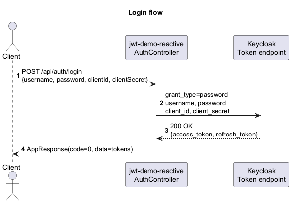
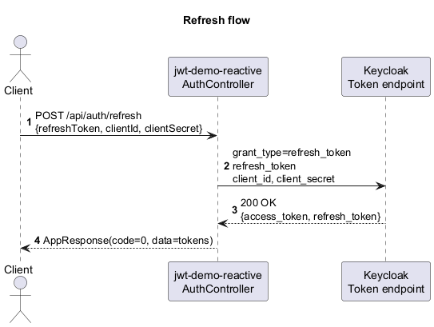
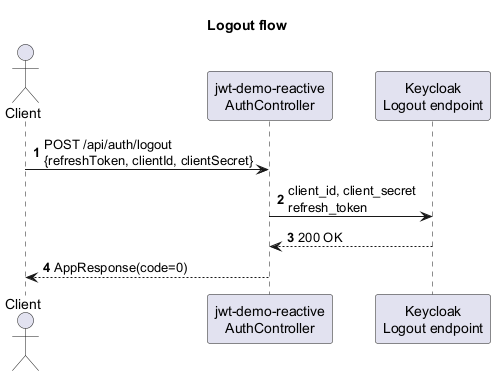
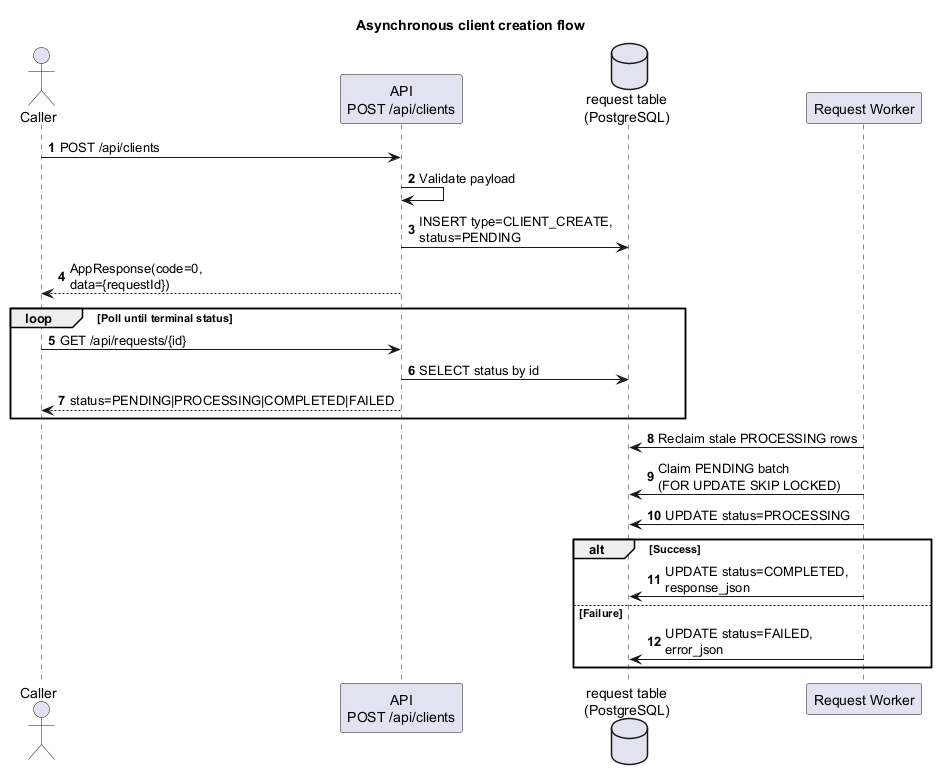
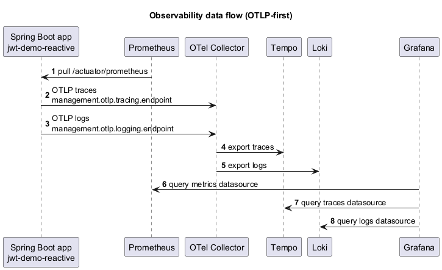

# 🔐 jwt-demo-reactive

Reactive OAuth2 proxy/service built with Spring Boot 4 + Java 25, using WebFlux, R2DBC, Keycloak, and OTLP-first observability.

## Documentation

- `API.md` - endpoint reference and response/error contract
- `SECURITY.md` - security policy and runtime security model
- `CONTRIBUTING.md` - contribution workflow and coding/testing standards
- `CHANGELOG.md` - notable project changes
- `docs/architecture.md` - architecture and sequence diagrams (PlantUML + PNG)

This project keeps the same business scenarios as `jwt-demo`, but the implementation is fully reactive:
- WebFlux controllers (`Mono<AppResponse<...>>`)
- R2DBC + PostgreSQL persistence
- Async request lifecycle (`PENDING -> PROCESSING -> COMPLETED|FAILED`)
- Security chain with Opaque Token Introspection + DPoP + Rate Limiting

---

## 📄 License

This project is licensed under the MIT License. See `LICENSE` for details.


## ✨ Supported Features

- Username/password login, token refresh, logout (`/api/auth/*`)
- Opaque token introspection for protected APIs
- DPoP support for auth endpoints and protected endpoints
- Role-based authorization (`CLIENT_CREATE`, `CLIENT_GET`, `CLIENT_SEARCH`, `UPDATE_BALANCE`)
- Async client creation request queue + status endpoint
- Account balance updates (pessimistic and optimistic flows)
- OTLP-first observability:
  - traces: Spring Boot -> OTel Collector -> Tempo
  - logs: Spring Boot -> OTel Collector -> Loki
  - metrics: Prometheus scrapes `/actuator/prometheus`

---

## 📦 Tech Stack

- Java 25
- Spring Boot 4.0.3
- Spring WebFlux
- Spring Security OAuth2 Resource Server
- PostgreSQL + Flyway
- Spring Data R2DBC
- Bucket4j + Caffeine
- OpenTelemetry + Micrometer + Prometheus
- Grafana + Loki + Tempo + OTel Collector
- Testcontainers + WireMock + Awaitility

---

## 🚀 Running the Project

### 0. Configure Environment Variables

Create `.env` from the template:

```pwsh
Set-Location <repo-root>
Copy-Item .env.example .env
```

Set real values for secrets in `.env`:
- `APP_DB_PASSWORD`
- `KEYCLOAK_ADMIN_PASSWORD`
- `KEYCLOAK_RESOURCE_CLIENT_SECRET`
- `GRAFANA_ADMIN_PASSWORD`

Resource server introspection credentials must match the Keycloak realm import (`src/test/resources/keycloak/realm-export.json`):
- `KEYCLOAK_RESOURCE_CLIENT_ID`
- `KEYCLOAK_RESOURCE_CLIENT_SECRET`

### 1. Start Full Stack (Docker Compose)

```pwsh
Set-Location <repo-root>
docker compose up -d --build
```

Check status:

```pwsh
docker compose ps
```

Stop:

```pwsh
docker compose down
```

Stop and remove volumes:

```pwsh
docker compose down -v
```

### 2. Alternative Local Run (without app container)

When running via `mvn spring-boot:run`, `.env` is not auto-loaded by Spring Boot.
Set required variables in your shell first (note the host Keycloak URL):

```pwsh
$env:KEYCLOAK_RESOURCE_CLIENT_ID = "resource-server"
$env:KEYCLOAK_RESOURCE_CLIENT_SECRET = "<secret-from-realm-export-or-keycloak>"
$env:KEYCLOAK_AUTH_SERVER_URL = "http://localhost:8080"
```

```pwsh
Set-Location <repo-root>
docker compose up -d postgres keycloak
mvn spring-boot:run
```

---

## 🧱 Compose Services

- `app` - application (`:8081`)
- `postgres` - database (`:5432`)
- `keycloak` - auth server (`:8080`)
- `prometheus` - metrics (`:9090`)
- `grafana` - dashboards (`:3000`)
- `loki` - logs (`:3100`)
- `tempo` - traces (`:3200`)
- `otel-collector` - OTLP ingest/export

---

## 🌐 Useful URLs

- API base: `http://localhost:8081`
- Swagger UI: `http://localhost:8081/swagger-ui.html`
- OpenAPI JSON: `http://localhost:8081/v3/api-docs`
- Prometheus: `http://localhost:9090`
- Grafana: `http://localhost:3000`
- Loki readiness: `http://localhost:3100/ready`
- Tempo: `http://localhost:3200`
- App metrics endpoint: `http://localhost:8081/actuator/prometheus`

---

## 📚 Swagger / OpenAPI

The OpenAPI spec is generated at runtime.

Helpful links:
- Swagger UI: `http://localhost:8081/swagger-ui.html`
- OpenAPI JSON: `http://localhost:8081/v3/api-docs`

Tip: use Swagger UI for quick token-based checks after login (`/api/auth/login`), then call protected endpoints with `Bearer` or `DPoP` authorization.

---

## 🛡 Security Model

Public routes:
- `/api/auth/**`
- `/v3/api-docs/**`, `/swagger-ui/**`, `/swagger-ui.html`
- `/actuator/prometheus`

All other routes require authentication.

Authorization options:
- `Authorization: Bearer <access_token>`
- `Authorization: DPoP <access_token>` and `DPoP: <proof-jwt>`

---

## 🎯 API Access Matrix

| Endpoint | Method | Access | Required Role |
|----------|--------|--------|---------------|
| `/api/auth/login` | `POST` | Public | - |
| `/api/auth/refresh` | `POST` | Public | - |
| `/api/auth/logout` | `POST` | Public | - |
| `/api/clients` | `POST` | Protected | `CLIENT_CREATE` |
| `/api/clients/{id}` | `GET` | Protected | `CLIENT_GET` |
| `/api/clients/search` | `GET` | Protected | `CLIENT_SEARCH` |
| `/api/requests/{id}` | `GET` | Protected | `CLIENT_CREATE` |
| `/api/accounts/balance/pessimistic` | `POST` | Protected | `UPDATE_BALANCE` |
| `/api/accounts/balance/optimistic` | `POST` | Protected | `UPDATE_BALANCE` |
| `/api/accounts/client/{clientId}` | `GET` | Protected | `CLIENT_GET` |

---

## 🛡 Protected Endpoints

| Endpoint | Method | Required Role | Accepted Auth Scheme |
|----------|--------|---------------|----------------------|
| `/api/clients` | `POST` | `CLIENT_CREATE` | `Bearer` or `DPoP` |
| `/api/requests/{id}` | `GET` | `CLIENT_CREATE` | `Bearer` or `DPoP` |
| `/api/clients/{id}` | `GET` | `CLIENT_GET` | `Bearer` or `DPoP` |
| `/api/clients/search` | `GET` | `CLIENT_SEARCH` | `Bearer` or `DPoP` |
| `/api/accounts/client/{clientId}` | `GET` | `CLIENT_GET` | `Bearer` or `DPoP` |
| `/api/accounts/balance/pessimistic` | `POST` | `UPDATE_BALANCE` | `Bearer` or `DPoP` |
| `/api/accounts/balance/optimistic` | `POST` | `UPDATE_BALANCE` | `Bearer` or `DPoP` |

---

## 📊 Sequence Diagram (Login / Refresh / Logout)

### Login flow



Source: `docs/diagrams/sequence-auth-login.puml`

### Refresh flow



Source: `docs/diagrams/sequence-auth-refresh.puml`

### Logout flow



Source: `docs/diagrams/sequence-auth-logout.puml`

---

## 📬 Asynchronous Client Creation Flow

`POST /api/clients` does not create a client synchronously.



Source: `docs/diagrams/sequence-async-client-create.puml`

For multi-instance safety, stale `PROCESSING` reclaim is implemented and indexed (`V2__add_request_reclaim_index.sql`).

---

## 🌱 Seed Data / Performance Notes

### Seed data

- Keycloak realm is auto-imported from `src/test/resources/keycloak/realm-export.json`.
- Demo users included in realm import:
  - `user` / `password`
  - `admin` / `admin`
- Demo clients in realm import include:
  - `spring-app`
  - `resource-server` (used for opaque token introspection)

### Performance notes

- Client search supports trigram indexes if `pg_trgm` extension exists; migration creates indexes conditionally.
- Async worker tunables are configurable in `application.properties`:
  - `app.request.worker.batch-size`
  - `app.request.worker.max-concurrency` (env: `APP_REQUEST_WORKER_MAX_CONCURRENCY`)
  - `app.request.worker.interval-ms`
  - `app.request.worker.retry.max-attempts`
  - `app.request.worker.retry.backoff-ms`
  - `app.request.worker.processing-timeout`
- Reclaim path is optimized by index:
  - `idx_request_status_type_status_changed_at` on `(status, type, status_changed_at)`
- Basic perf smoke scenario with before/after metric diff:
  - script: `ops/perf/perf-smoke.ps1`
  - usage docs: `ops/perf/README.md`
  - output reports: `target/perf/perf-smoke-*.{json,md}`

---

## 📊 Observability (OTLP-first)

Telemetry pipelines:
- traces: `management.otlp.tracing.endpoint`
- logs: `management.otlp.logging.endpoint`
- metrics: Prometheus scrape `/actuator/prometheus`

Custom business/security metrics:
- `auth.login{result}` - login attempts (`success`/`failure`)
- `auth.refresh{result}` - refresh attempts (`success`/`failure`)
- `auth.logout{result}` - logout attempts (`success`/`failure`)
- `security.http.responses{status,endpoint_group}` - counters for `401/403` responses from security handlers
- `security.dpop.rejected{reason}` - DPoP rejection counters grouped by normalized reason (`scheme_required`, `proof_missing`, `replay_detected`, etc.)
- `security.opaque_introspection.cache{result}` - opaque token introspection cache `hit/miss`
- `security.rate_limit.decisions{rule_id,key_strategy,decision}` - rate limit decisions (`allowed/rejected`) per rule
- `request.worker.reclaimed_count` - number of stale `PROCESSING` requests reclaimed back to `PENDING`
- `request.worker.stale_processing_age` - age of the oldest reclaimed stale `PROCESSING` request
- `request.worker.claim_lag_seconds` - claim lag distribution (request creation -> worker claim)
- `request.worker.claim_batch_size` - distribution of claimed batch size per worker iteration
- `request.worker.processing_duration{terminal_status}` - processing duration timer for `COMPLETED/FAILED`
- `request.worker.terminal_status{status}` - terminal status counters (`COMPLETED/FAILED`)

Recommended settings:
- `management.logging.export.otlp.enabled=true`
- `management.otlp.metrics.export.enabled=false`
- `management.tracing.sampling.probability=1.0`



Source: `docs/diagrams/sequence-observability-flow.puml`

---

## 📊 Alert Thresholds and On-Call Runbook

The following alerts are provisioned from `ops/grafana/provisioning/alerting/alerts.yml`.

| Alert UID | Signal | Threshold | For | Severity |
|----------|--------|-----------|-----|----------|
| `jwt-high-5xx-rate` | 5xx error rate | `> 5%` | `5m` | `warning` |
| `jwt-high-p95-latency` | p95 HTTP latency | `> 800 ms` | `5m` | `warning` |
| `jwt-high-cpu-saturation` | process CPU usage | `> 90%` | `10m` | `critical` |
| `jwt-high-heap-saturation` | JVM heap usage | `> 90%` | `10m` | `critical` |
| `jwt-high-rate-limit-reject-ratio` | rate-limit reject ratio | `> 20%` | `5m` | `warning` |
| `jwt-dpop-reject-spike` | DPoP rejected requests | `> 20 events / 5m` | `5m` | `warning` |
| `jwt-worker-failed-terminal-ratio` | async worker FAILED terminal ratio | `> 10%` | `10m` | `warning` |

On-call quick actions:
1. Open Grafana and locate the firing rule in Alerting.
2. Check RED and saturation dashboards for trend confirmation.
3. For request-level incidents, capture `X-Trace-Id` (when available) and pivot to Tempo and Loki.
4. In Loki, filter by the same trace id and inspect related error/security logs.
5. In Tempo, inspect the slow/error spans and identify the failing upstream or handler.
6. For `critical` alerts (`CPU`/`Heap`), page immediately if sustained beyond the configured `for` window.
7. For `warning` alerts, escalate if impact persists for two consecutive evaluation windows.

PromQL examples for custom metrics:
- Rate-limit reject ratio (5m): `100 * sum(rate(security_rate_limit_decisions_total{decision="rejected"}[5m])) / clamp_min(sum(rate(security_rate_limit_decisions_total[5m])), 1)`
- DPoP reject spike (5m): `sum(increase(security_dpop_rejected_total[5m]))`
- Worker failed ratio (10m): `100 * sum(rate(request_worker_terminal_status_total{status="FAILED"}[10m])) / clamp_min(sum(rate(request_worker_terminal_status_total[10m])), 1)`

---

## 🧪 Testing

Run unit tests:

```pwsh
mvn test
```

Run integration tests:

```pwsh
mvn verify
```

Main integration suites:
- `AuthControllerIT`
- `AuthValidationIT`
- `KeycloakIntegrationIT`
- `KeycloakNegativeIT`
- `DpopIntegrationIT`
- `RateLimitingIT`
- `SecurityChainRegressionIT`
- `RequestIntegrationIT`
- `RequestWorkerRetryIT`
- `RequestWorkerReclaimIT`
- `RequestWorkerMultiInstanceIT`
- `AccountIntegrationIT`

---

## 🧱 Project Structure

- `src/main/java/lt/satsyuk/controller` - REST entry points
- `src/main/java/lt/satsyuk/service` - business logic
- `src/main/java/lt/satsyuk/repository` - R2DBC repositories
- `src/main/resources/db/migration` - Flyway migrations
- `ops/` - observability configs (Prometheus/Loki/Tempo/OTel/Grafana)
- `docker-compose.yml` - local infrastructure stack

---

# 🛠 Troubleshooting

- `401 invalid_client` on protected API: verify `KEYCLOAK_RESOURCE_CLIENT_ID` / `KEYCLOAK_RESOURCE_CLIENT_SECRET`.
- `403` on protected API: verify token roles in `realm_access.roles`.
- No logs/traces in Grafana: verify `MANAGEMENT_OTLP_TRACING_ENDPOINT` and `MANAGEMENT_OTLP_LOGGING_ENDPOINT`.
- Integration tests fail without Docker: start Docker Desktop before `mvn verify`.

### DPoP 401/403 checklist

- For DPoP-bound tokens, send both headers:
  - `Authorization: DPoP <access_token>`
  - `DPoP: <proof-jwt>`
- Validate proof claims and binding:
  - `htm` and `htu` must match the exact request method and URL
  - `iat` must be within allowed time window
  - `jti` must be unique (replay protection)
  - `ath` must match the access token hash
  - token `cnf.jkt` must match proof key thumbprint

### Trace-ID correlation for incidents

- When the API returns `X-Trace-Id`, use it as the primary correlation key.
- In Loki, filter by trace id from logs (MDC includes `traceId`/`spanId`).
- In Tempo, search by the same trace id to inspect span timeline.
- This is the fastest path to diagnose `401`, `403`, and `429` scenarios across API + security filters.

---
